# BeeShoes GitOps Deployment Architecture

This document explains the **separate repositories deployment approach** for the BeeShoes three-tier application, inspired by **GitLab CI patterns**.

## 🏗️ Repository Architecture

### **Two Repository Pattern:**

```mermaid
graph LR
    A[👨‍💻 Source Code Repository] -->|Build & Push Image| B[🐳 Container Registry]
    A -->|Update Image Tag| C[📦 Helm Chart Repository]
    C -->|Deploy| D[☸️ Kubernetes Cluster]
    B -->|Pull Image| D
    
    subgraph "Code Repository"
        A1[Frontend Source]
        A2[Backend Source]
        A3[CI/CD Workflows]
    end
    
    subgraph "Helm Chart Repository"
        C1[values-dev.yaml]
        C2[values-staging.yaml]
        C3[values-prod.yaml]
        C4[Kubernetes Manifests]
    end
```



### **Repository Responsibilities:**

| Repository | Purpose | Contains | Managed By |
|------------|---------|----------|------------|
| **beeshoes-app-code** | Source Code & CI/CD | Frontend, Backend, Workflows | Developers |
| **beeshoes-helm-charts** | Deployment Configuration | Helm Charts, Values Files | DevOps Team |

## 🔄 Deployment Flow (GitOps Pattern)

### **Inspired by GitLab CI Implementation:**

Based on the GitLab CI pattern from `ecommerce-microservices` project:

```bash
# Original GitLab CI approach:
git clone https://${GITHUB_TOKEN}@github.com/${GITHUB_USERNAME}/${HELM_REPO}.git
cd ${HELM_REPO}

yq -i ".$BRANCH_NAME.image.tag = \"${IMAGE_TAG}\"" ./dev-values.yaml

git add .
git commit -m "feat: update ${BRANCH_NAME} images tag:${CI_COMMIT_SHORT_SHA}"
git push https://${GITHUB_TOKEN}@github.com/${GITHUB_USERNAME}/${HELM_REPO}.git main
```

### **GitHub Actions Implementation:**

```yaml
# 1. Build and push Docker image
- name: Build and push Docker image
  run: |
    docker build -t ${{ env.REGISTRY }}/beeshoes/frontend:${IMAGE_TAG} .
    docker push ${{ env.REGISTRY }}/beeshoes/frontend:${IMAGE_TAG}

# 2. Update Helm Chart Repository
- name: Update Helm Chart Repository
  run: |
    # Clone helm chart repository
    git clone https://${{ secrets.HELM_CHART_TOKEN }}@github.com/${{ secrets.HELM_CHART_REPO_OWNER }}/${{ secrets.HELM_CHART_REPO_NAME }}.git helm-chart-repo
    cd helm-chart-repo
    
    # Update image tag in values file
    yq eval '.frontend.image.tag = "'${IMAGE_TAG}'"' -i charts/beeshoes-app/values-dev.yaml
    
    # Commit and push changes
    git add charts/beeshoes-app/values-dev.yaml
    git commit -m "feat(frontend): update dev image tag to ${IMAGE_TAG}"
    git push origin main
```

## 🔑 Required GitHub Secrets

### **Code Repository Secrets:**

| Secret Name | Description | Example Value | Used In |
|-------------|-------------|---------------|---------|
| `HELM_CHART_TOKEN` | GitHub Personal Access Token for helm chart repo | `ghp_xxxxxxxxxxxx` | All workflows |
| `HELM_CHART_REPO_OWNER` | Owner of helm chart repository | `your-org` | All workflows |
| `HELM_CHART_REPO_NAME` | Name of helm chart repository | `beeshoes-helm-charts` | All workflows |
| `GIT_EMAIL` | Git commit email | `devops@beeshoes.com` | All workflows |
| `GIT_USERNAME` | Git commit username | `beeshoes-bot` | All workflows |
| `HARBOR_URL` | Container registry URL | `harbor.deploy.io.vn` | Build workflows |
| `HARBOR_USERNAME` | Container registry username | `robot$beeshoes` | Build workflows |
| `HARBOR_PASSWORD` | Container registry password | `xxxxxxxxxx` | Build workflows |

### **Environment-Specific Secrets (Optional):**

These secrets are **NOT required** in the code repository since we use environment-specific values files:

| Secret Type | Dev | Staging | Production | Note |
|-------------|-----|---------|------------|------|
| Database Password | ❌ Not needed | ❌ Not needed | ❌ Not needed | Configured in values files |
| JWT Secret | ❌ Not needed | ❌ Not needed | ❌ Not needed | Configured in values files |
| Cloudinary Keys | ❌ Not needed | ❌ Not needed | ❌ Not needed | Configured in values files |
| Mail Credentials | ❌ Not needed | ❌ Not needed | ❌ Not needed | Configured in values files |

> **Note**: All application secrets are managed in the **Helm Chart Repository** values files and Kubernetes secrets.

## 📁 File Structure Updates

### **Code Repository (beeshoes-app-code):**

```
beeshoes-app-code/
├── frontend/                    # React application
│   ├── src/
│   ├── Dockerfile
│   └── package.json
├── backend/                     # Spring Boot application  
│   ├── src/
│   ├── Dockerfile
│   └── pom.xml
└── .github/
    └── workflows/               # CI/CD workflows
        ├── frontend-dev.yml     # ✅ Updates values-dev.yaml
        ├── backend-dev.yml      # ✅ Updates values-dev.yaml
        ├── frontend-staging.yml # ✅ Updates values-staging.yaml
        ├── backend-staging.yml  # ✅ Updates values-staging.yaml
        ├── frontend-prod.yml    # ✅ Updates values-prod.yaml
        └── backend-prod.yml     # ✅ Updates values-prod.yaml
```

### **Helm Chart Repository (beeshoes-helm-charts):**

```
beeshoes-helm-charts/
├── charts/
│   └── beeshoes-app/
│       ├── templates/           # Kubernetes manifests
│       ├── values.yaml          # Default values
│       ├── values-dev.yaml      # ✅ Updated by dev workflows
│       ├── values-staging.yaml  # ✅ Updated by staging workflows
│       ├── values-prod.yaml     # ✅ Updated by prod workflows
│       └── Chart.yaml
└── README.md
```

## 🎯 Deployment Workflow

### **1. Developer Workflow:**

```bash
# 1. Developer pushes code to feature branch
git push origin feature/new-feature

# 2. Merge to develop branch triggers dev deployment
git checkout develop
git merge feature/new-feature
git push origin develop

# 3. CI/CD automatically:
#    - Builds Docker image with new tag
#    - Updates values-dev.yaml in helm chart repo
#    - Commits changes to helm chart repo
```

### **2. Image Tag Updates:**

| Environment | Values File | Updated By | Trigger |
|-------------|-------------|------------|---------|
| **Development** | `values-dev.yaml` | `frontend-dev.yml`, `backend-dev.yml` | Merge to `develop` |
| **Staging** | `values-staging.yaml` | `frontend-staging.yml`, `backend-staging.yml` | Tag push `*-staging` |
| **Production** | `values-prod.yaml` | `frontend-prod.yml`, `backend-prod.yml` | Tag push `*-prod` |

### **3. Deployment Methods:**

#### **Option A: Manual Helm Deployment**
```bash
# DevOps team manually deploys from helm chart repo
git clone https://github.com/your-org/beeshoes-helm-charts.git
cd beeshoes-helm-charts

helm upgrade --install beeshoes-app ./charts/beeshoes-app \
  -f ./charts/beeshoes-app/values-dev.yaml \
  --namespace beeshoes-dev
```

#### **Option B: ArgoCD GitOps (Recommended)**
```yaml
apiVersion: argoproj.io/v1alpha1
kind: Application
metadata:
  name: beeshoes-app-dev
spec:
  source:
    repoURL: https://github.com/your-org/beeshoes-helm-charts.git
    path: charts/beeshoes-app
    helm:
      valueFiles:
        - values-dev.yaml
  destination:
    namespace: beeshoes-dev
  syncPolicy:
    automated:
      prune: true
      selfHeal: true
```

## ⚙️ Environment Configuration

### **Environment-Specific Image Tags:**

Each environment automatically gets updated with new image tags:

```yaml
# values-dev.yaml (updated by dev workflows)
frontend:
  image:
    tag: "sha-abc123f"  # ✅ Auto-updated

# values-staging.yaml (updated by staging workflows)
frontend:
  image:
    tag: "sha-def456a"  # ✅ Auto-updated

# values-prod.yaml (updated by prod workflows)
frontend:
  image:
    tag: "sha-789xyz1"  # ✅ Auto-updated
```

### **Resource Configuration:**

| Environment | Frontend | Backend | Database | Total Resources |
|-------------|----------|---------|----------|-----------------|
| **Development** | 1 pod, 50m-100m CPU | 1 pod, 100m-200m CPU | 5Gi storage | ~500m CPU, ~896Mi RAM |
| **Staging** | 2 pods, 100m-200m CPU | 2 pods, 100m-200m CPU | 15Gi storage | ~900m CPU, ~1200Mi RAM |
| **Production** | 2 pods, 100m-200m CPU | 2 pods, 100m-200m CPU | 50Gi storage | ~1400m CPU, ~1424Mi RAM |

## 🛠️ Setup Instructions

### **1. Create Helm Chart Repository:**

```bash
# Create new repository: beeshoes-helm-charts
git clone https://github.com/your-org/beeshoes-helm-charts.git
cd beeshoes-helm-charts

# Copy helm chart files (already done)
cp -r /path/to/three-tier-app/helm-chart/beeshoes-app ./charts/
```

### **2. Configure GitHub Secrets:**

In the **code repository** (beeshoes-app-code), add these secrets:

```bash
# Repository secrets
HELM_CHART_TOKEN=ghp_xxxxxxxxxxxx
HELM_CHART_REPO_OWNER=your-org
HELM_CHART_REPO_NAME=beeshoes-helm-charts
GIT_EMAIL=devops@beeshoes.com
GIT_USERNAME=beeshoes-bot

# Container registry secrets
HARBOR_URL=harbor.deploy.io.vn
HARBOR_USERNAME=robot$beeshoes
HARBOR_PASSWORD=xxxxxxxxxx
```

### **3. Deploy with ArgoCD (Optional):**

```bash
# Install ArgoCD
kubectl create namespace argocd
kubectl apply -n argocd -f https://raw.githubusercontent.com/argoproj/argo-cd/stable/manifests/install.yaml

# Create applications for each environment
kubectl apply -f argocd-applications/
```

## 🚀 Benefits of This Approach

### **✅ Advantages:**

1. **Separation of Concerns**: Code and deployment configs are separate
2. **GitOps Compliance**: All deployment changes are tracked in git
3. **Environment Consistency**: Same helm chart, different values
4. **Easy Rollbacks**: Git-based rollback mechanism
5. **Security**: Secrets managed in helm chart repo only
6. **DevOps Control**: DevOps team controls deployment configurations

### **📋 Workflow Summary:**


## 🔄 Migration from Current Setup

### **Current vs New Approach:**

| Aspect | **Current (Single Repo)** | **New (Separate Repos)** |
|--------|---------------------------|---------------------------|
| **Code & Charts** | Same repository | Separate repositories |
| **Deployment** | Direct helm install | Update values → GitOps |
| **Secrets** | In code repo workflows | In helm chart values |
| **Configuration** | Inline `--set` commands | Environment-specific files |
| **Rollback** | Manual helm rollback | Git-based rollback |
| **Security** | Secrets in code repo | Secrets in deployment repo |

---

**Next Steps:**
1. ✅ Create separate helm chart repository  
2. ✅ Update GitHub Actions workflows  
3. ⏳ Configure GitHub secrets  
4. ⏳ Setup ArgoCD applications (optional)  
5. ⏳ Test deployment flow  

**Maintained By**: DevOps Team  
**Last Updated**: $(date '+%Y-%m-%d') 