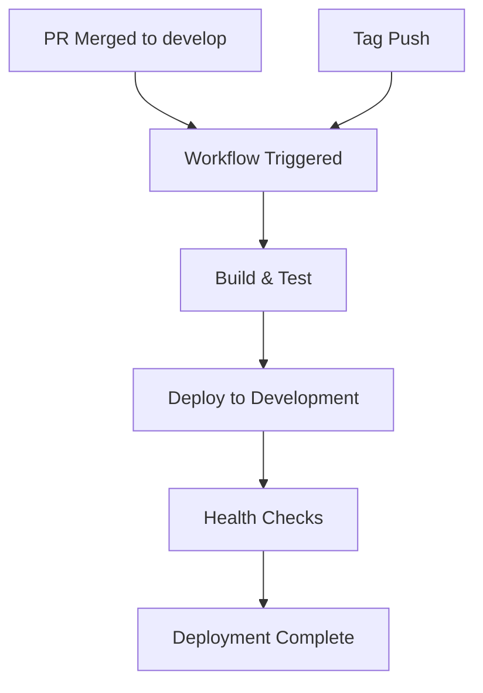
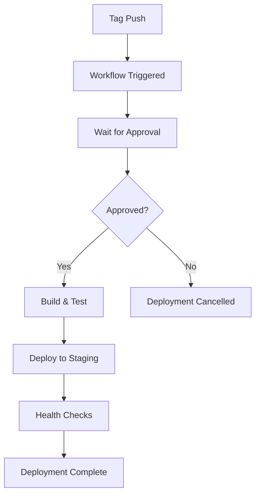
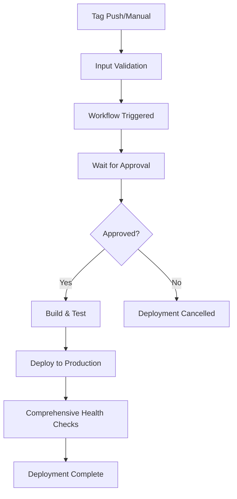

# GitHub Environment Setup for BeeShoes Three-Tier Application

This guide explains how to configure GitHub Environments with protection rules for the BeeShoes three-tier application CI/CD pipelines.

## 🎯 Overview

The BeeShoes application uses GitHub Environments to implement approval workflows and environment-specific configurations:

- **development** - Automatic deployment for merged PRs and tags
- **staging** - Manual approval required for deployment
- **production** - Manual approval + confirmation required for deployment

## 🔧 Environment Configuration

### 1. Create GitHub Environments

Navigate to your repository: **Settings → Environments → New environment**

Create the following three environments:

#### Environment: `development`

- **Name**: `development`
- **Description**: Development environment for BeeShoes application
- **URL**: `https://beeshoes-dev.deploy.io.vn`

#### Environment: `staging`

- **Name**: `staging`
- **Description**: Staging environment for BeeShoes application
- **URL**: `https://beeshoes-staging.deploy.io.vn`

#### Environment: `production`

- **Name**: `production`
- **Description**: Production environment for BeeShoes application
- **URL**: `https://beeshoes.deploy.io.vn`

### 2. Configure Protection Rules

#### Development Environment

- **Protection Rules**: None (automatic deployment)
- **Deployment Branches**: `develop` branch only
- **Environment Secrets**: Dev-specific credentials

#### Staging Environment

- **Protection Rules**:
  - ✅ **Required reviewers**: 1-2 reviewers
  - ✅ **Restrict pushes to protected branches**: Enable
  - ✅ **Deployment branches**: Selected branches/tags only
- **Deployment Branches**:
  - `main` branch
  - Tags matching: `*-staging-*`, `release-staging-*`
- **Required Reviewers**: DevOps team members, Tech leads

#### Production Environment

- **Protection Rules**:
  - ✅ **Required reviewers**: 2-3 reviewers
  - ✅ **Restrict pushes to protected branches**: Enable
  - ✅ **Deployment branches**: Selected branches/tags only
  - ✅ **Wait timer**: 5 minutes (optional)
- **Deployment Branches**:
  - `main` branch only
  - Tags matching: `v*`, `*-prod-*`, `release-prod-*`
- **Required Reviewers**: Senior DevOps engineers, Team leads, Product owners

## 🔐 Secrets Configuration

### Repository Secrets

Navigate to: **Settings → Secrets and variables → Actions → Repository secrets**

#### Harbor Registry Access

```
HARBOR_USERNAME=your-harbor-username
HARBOR_PASSWORD=your-harbor-password
```

#### Kubernetes Cluster Access

```
KUBE_CONFIG_DEV=base64-encoded-kubeconfig-for-dev
KUBE_CONFIG_STAGING=base64-encoded-kubeconfig-for-staging
KUBE_CONFIG_PROD=base64-encoded-kubeconfig-for-prod
```

### Environment-Specific Secrets

#### Development Environment Secrets

Navigate to: **Environments → development → Add secret**

```
DB_PASSWORD_DEV=dev-database-password
JWT_SECRET_DEV=dev-jwt-secret-key
CLOUDINARY_NAME_DEV=dev-cloudinary-cloud-name
CLOUDINARY_API_KEY_DEV=dev-cloudinary-api-key
CLOUDINARY_API_SECRET_DEV=dev-cloudinary-api-secret
MAIL_USERNAME_DEV=dev-email@example.com
MAIL_PASSWORD_DEV=dev-email-password
```

#### Staging Environment Secrets

Navigate to: **Environments → staging → Add secret**

```
DB_PASSWORD_STAGING=staging-database-password
JWT_SECRET_STAGING=staging-jwt-secret-key
CLOUDINARY_NAME_STAGING=staging-cloudinary-cloud-name
CLOUDINARY_API_KEY_STAGING=staging-cloudinary-api-key
CLOUDINARY_API_SECRET_STAGING=staging-cloudinary-api-secret
MAIL_USERNAME_STAGING=staging-email@example.com
MAIL_PASSWORD_STAGING=staging-email-password
```

#### Production Environment Secrets

Navigate to: **Environments → production → Add secret**

```
DB_PASSWORD_PROD=production-database-password
JWT_SECRET_PROD=production-jwt-secret-key
CLOUDINARY_NAME_PROD=production-cloudinary-cloud-name
CLOUDINARY_API_KEY_PROD=production-cloudinary-api-key
CLOUDINARY_API_SECRET_PROD=production-cloudinary-api-secret
MAIL_USERNAME_PROD=production-email@example.com
MAIL_PASSWORD_PROD=production-email-password
```

## 👥 Reviewer Configuration

### Recommended Reviewer Setup

#### Development Environment

- **Reviewers**: None (automatic deployment)
- **Notifications**: Slack/Teams integration for deployment status

#### Staging Environment

- **Required Reviewers**: 1-2 people
- **Suggested Reviewers**:
  - DevOps Engineers
  - QA Team Leads
  - Backend/Frontend Team Leads
- **Review Process**:
  - Verify staging readiness
  - Check test results
  - Validate feature completeness

#### Production Environment

- **Required Reviewers**: 2-3 people
- **Suggested Reviewers**:
  - Senior DevOps Engineers
  - Technical Architects
  - Product Owners
  - Release Managers
- **Review Process**:
  - Verify staging deployment success
  - Review change logs and impact assessment
  - Confirm production readiness
  - Check compliance requirements

## 🚀 Deployment Branch Configuration

### Step-by-Step Branch Protection

#### 1. Development Environment

```
Deployment branches: Selected branches and tags
✅ develop
```

#### 2. Staging Environment

```
Deployment branches: Selected branches and tags
✅ main
Tags:
  - *-staging-*
  - release-staging-*
```

#### 3. Production Environment

```
Deployment branches: Selected branches and tags
✅ main
Tags:
  - v*
  - *-prod-*
  - release-prod-*
```

## 🔄 Approval Workflow

### Development Deployment



### Staging Deployment



### Production Deployment



## ⚠️ Important Configuration Notes

### Security Considerations

1. **Separate secrets** for each environment
2. **Least privilege access** for service accounts
3. **Regular rotation** of credentials
4. **Audit logging** enabled for all deployments

### Branch Protection Rules

1. **Protect main branch** from direct pushes
2. **Require PR reviews** before merging to main
3. **Status checks** must pass before merging
4. **Up-to-date branches** required

### Notification Setup

1. **Slack/Teams integration** for deployment notifications
2. **Email alerts** for failed deployments
3. **Dashboard monitoring** for deployment status

## 🧪 Testing the Setup

### 1. Test Development Deployment

```bash
# Create and merge a PR to develop
git checkout -b feature/test-deployment
git commit -m "Test development deployment"
git push origin feature/test-deployment

# Create PR and merge to develop
# Should trigger automatic deployment
```

### 2. Test Staging Deployment

```bash
# Create staging tag
git checkout main
git tag frontend-staging-v1.0.0
git push origin frontend-staging-v1.0.0

# Check GitHub Actions for approval request
# Approve deployment in GitHub UI
```

### 3. Test Production Deployment

```bash
# Create production tag
git checkout main
git tag v1.0.0
git push origin v1.0.0

# Check GitHub Actions for approval request
# Multiple approvals required
```

## 📊 Monitoring Setup

### GitHub Actions Monitoring

1. **Workflow status badges** in README
2. **Failed workflow notifications**
3. **Deployment duration tracking**
4. **Resource usage monitoring**

### Application Monitoring

1. **Health check endpoints** configured
2. **Prometheus metrics** exposed
3. **Grafana dashboards** for visualization
4. **Alertmanager** for critical alerts

## 🔧 Troubleshooting

### Common Setup Issues

#### Environment Not Found

```bash
Error: Environment 'staging' not found
Solution: Create the environment in GitHub repository settings
```

#### Approval Required But No Reviewers

```bash
Error: Required reviewers not configured
Solution: Add reviewers in environment protection rules
```

#### Secrets Not Available

```bash
Error: Secret 'DB_PASSWORD_STAGING' not found
Solution: Add the secret to the specific environment
```

#### Wrong Branch/Tag Pattern

```bash
Error: Deployment branch restrictions
Solution: Check deployment branch configuration
```

### Validation Checklist

- [ ] All three environments created
- [ ] Protection rules configured correctly
- [ ] Required reviewers assigned
- [ ] Deployment branches configured
- [ ] All secrets added to environments
- [ ] Kubernetes access configured
- [ ] Harbor registry access configured
- [ ] Test deployments successful

## 📚 Additional Resources

- [GitHub Environments Documentation](https://docs.github.com/en/actions/deployment/targeting-different-environments/using-environments-for-deployment)
- [GitHub Environment Protection Rules](https://docs.github.com/en/actions/deployment/targeting-different-environments/using-environments-for-deployment#environment-protection-rules)
- [GitHub Secrets Management](https://docs.github.com/en/actions/security-guides/encrypted-secrets)

---

**Last Updated**: $(date '+%Y-%m-%d') | **Maintained by**: DevOps Team
